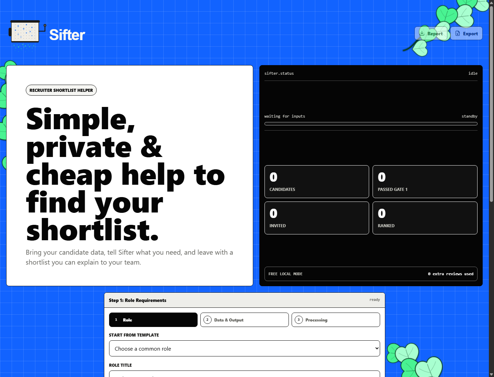
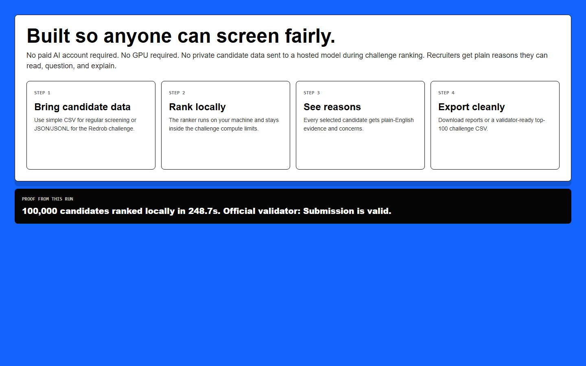
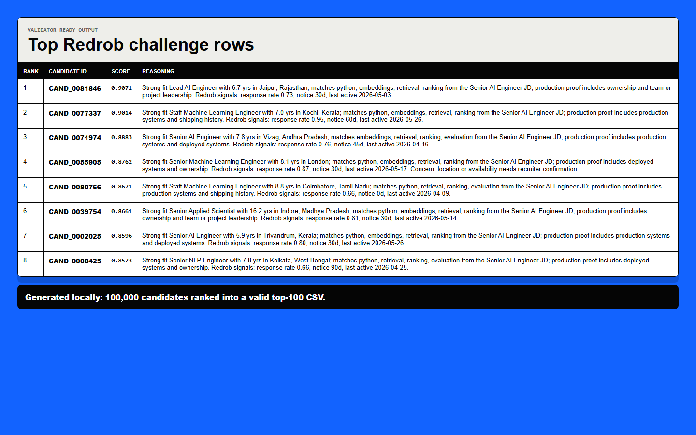
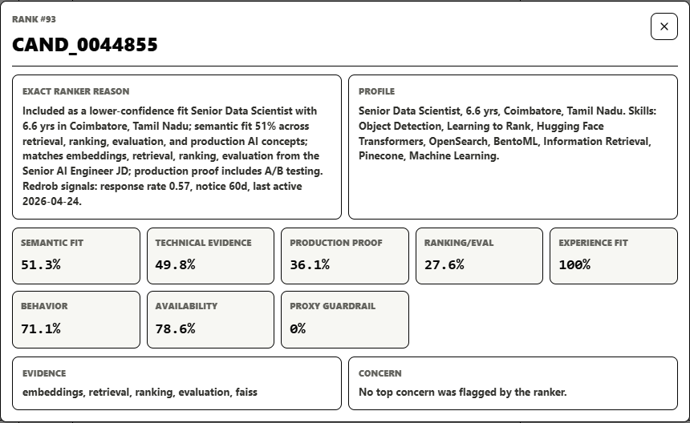

# Sifter

Sifter helps recruiters turn a messy candidate list into a clear, explainable shortlist.

It is built for people who need hiring help but may not have a big budget, a paid AI account, a GPU, or a technical team beside them. A recruiter should be able to open the app, describe the role, load candidates, and understand why someone was ranked.

Sifter is not trying to replace the recruiter. It does the heavy first pass, explains the evidence, points out risks, and leaves the final decision with a human.

Every major product decision is backed by research, challenge specs, or measured Redrob dataset facts. See [Research-Backed Product Decisions](docs/research-backed-decisions.md) and the generated [Redrob Evaluation Report](docs/redrob-evaluation-report.json).

## Live Demo

[Open Sifter on Firebase](https://sifter1011.web.app/)

Mirror URL: [https://sifter1011.firebaseapp.com](https://sifter1011.firebaseapp.com/)

The Firebase project id is `sifter1011`, so the default free Firebase domain is `sifter1011.web.app`.

## The Flow

Sifter was built as a chain of product decisions. Each feature exists because of a real recruiting problem.

## 1. Start With A Role, Not A Magic Score

**Problem:** Recruiters do not need a random AI score. They need to know what the job actually requires.

**Decision:** Make the role the first step. The user defines title, experience, stack, location, salary, project expectations, and extra notes.

**What we built:** A role builder with templates for common roles, including the Redrob Senior AI Engineer role.

**What is different:** Sifter does not start by ranking blindly. It first builds a job brief, then judges candidates against that brief.

## 2. Accept Simple Candidate Data

**Problem:** Many recruiters do not have a clean ATS export. They may only have a CSV or challenge file.

**Decision:** Support practical file formats first instead of forcing users into a heavy enterprise setup.

**What we built:** Candidate ingestion for CSV, JSON, JSONL, and gzipped Redrob challenge data. The normal app flow works with simple recruiter CSVs. The Redrob ranker works with the challenge candidate files.

**What is different:** Sifter is usable by a founder, recruiter, student, or hackathon reviewer without buying a recruiting platform first.

## 3. Keep Large Processing Out Of The Browser

**Problem:** Huge candidate lists can crash browser apps or make phones and older laptops unusable.

**Decision:** Use the browser for interaction and the local CLI for very large ranking jobs. For the large path, split the candidate pool into parallel batches, rank each batch, then merge the winners in rounds.

**What we built:** A batch-tournament Redrob ranker. By default, `100,000` candidates are split into `10` batches. Each batch is ranked in parallel. Then Sifter combines two ranked batches at a time, ranks that smaller winner pool, and repeats until one final top list remains.

**What is different:** The website stays lightweight, while the heavy ranking path becomes easier to scale. Instead of making one giant ranking pass carry all the pressure, Sifter reduces the problem in stages: `10 batches -> 5 merged batches -> 3 -> 2 -> 1 final ranking`.

## 4. Rank With Evidence, Not Just Keywords

**Problem:** Keyword filters miss good candidates and reward people who stuff resumes with exact words.

**Decision:** Use multiple evidence signals instead of a single keyword match.

**What we built:** The Redrob ranker now uses a hybrid score: semantic concept matching, normalized JD/profile vector similarity, structured skill evidence, production proof, ranking/evaluation depth, recruiter-learning fit, Redrob behavioral signals, penalties, and proxy guardrails. The API/CLI also has an optional Transformers.js reranker using `Xenova/all-MiniLM-L6-v2` for environments where the local model is available, plus a Hugging Face learned reranker hook for the trained `shikharshahi/sifter-redrob-reranker` model.

**What is different:** The rank is not only "does the resume contain this word?" It embeds the job and candidate profile into a comparable vector space, then asks whether the candidate shows evidence for the role concepts Redrob actually requested: retrieval, ranking, evaluation, production ML, shipping ownership, and LLM depth.

## 5. Learn From Recruiter Judgment

**Problem:** A ranker should improve from recruiter behavior, not freeze one set of weights forever.

**Decision:** Add a recruiter-learning signal and let users mark candidates while reviewing.

**What we built:** The score now includes a recruiter-learning component that favors production proof, ranking/evaluation depth, vector fit, and role evidence over shallow activity. Candidate info dialogs also include local feedback buttons: Strong fit, Maybe, and Not fit.

**What is different:** Sifter can now act like a recruiter reviewing profiles and remember review judgments locally, instead of only showing a static score.

## 6. Explain Every Shortlist

**Problem:** Recruiters, founders, and compliance teams cannot act on a black-box score.

**Decision:** Every recommended candidate should come with a reason.

**What we built:** Candidate output includes rank, score, and plain-English reasoning. Normal recruiter reports include strengths, weaknesses, missing evidence, next action, and interview questions.

**What is different:** Sifter does not just say "Rank 1". It explains why the candidate made the shortlist and what still needs to be checked.

## 7. Add Reviewer Agents To Challenge The Result

**Problem:** One ranking view can miss things. Hiring teams usually look at the same candidate from different angles.

**Decision:** Add small reviewer agents that cross-question the final output.

**What we built:** Final results now include four perspectives:

- **Hiring Manager:** can this person do the actual job?
- **Interview Designer:** what should we ask to test the weakest assumption?
- **Recruiter Ops:** are salary, location, notice, and availability practical?
- **Bias & Compliance:** are we deciding based on job proof, not identity clues or proxies?

**What is different:** The result is not one opinion pretending to be final truth. It is a shortlist plus 3-4 structured challenges before a human decision.

## 8. Build Bias Guardrails Into The Workflow

**Problem:** AI hiring tools can accidentally reward identity clues, school prestige, location shortcuts, or other proxy signals.

**Decision:** Keep protected and proxy fields out of scoring, then show a bias audit in plain English.

**What we built:** Sifter avoids scoring boosts from names, anonymized names, school prestige, education tier, language, or protected traits. It also limits logistics signals like location, notice period, response rate, and activity so they cannot overpower job evidence.

**What is different:** Sifter does not say "trust the AI". It shows what was excluded, what was checked, and where a human should review possible skew.

Important limitation: the Redrob dataset does not include protected demographic labels, so Sifter cannot prove protected-class parity on that data. What it can do today is remove unsafe scoring inputs, explain the score, and highlight proxy patterns.

## 9. Stay Local First

**Problem:** Candidate data is sensitive and AI calls can become expensive.

**Decision:** Make the main ranking flow local-first and deterministic.

**What we built:** The Redrob challenge ranking runs locally, CPU-only, and no-network. No hosted LLM call is required for the challenge ranking step.

**What is different:** Sifter can be cheaper, more private, easier to rerun, and easier to audit.

## 10. Make The Challenge Easy To Test Live

**Problem:** Reviewers should be able to try the app without setting up the repo.

**Decision:** Add a live Redrob Challenge button, but keep the user in control of the flow.

**What we built:** The button stays on Step 1 and only inserts the Redrob role plus the 100,000-candidate challenge data. The user then clicks Continue to review Step 2, and only clicks Rank challenge when they want Step 3 processing to begin.

**What is different:** Judges can inspect the setup before the app moves. The visible batch-ranking showcase, merge rounds, reviewer agents, bias guardrail, top candidate explanation, CSV export, and full candidate pages appear only after the user starts the ranking step.

## 11. Plan For Full Candidate Search

**Problem:** Recruiters eventually need to search a full pool by candidate, location, skill, experience, salary, availability, rank, and score.

**Decision:** Do not load the raw 487 MB dataset into every browser. For the live demo, split the ranked index into 100-candidate pages. For production, move the same idea behind a backend-indexed search service.

**What we built today:** The live app shows the full `100,000` candidate Redrob index as real pages: page 1 is ranks 1-100, page 2 is ranks 101-200, and so on. Recruiters can use Previous/Next or type a page number directly, then search within that visible page by candidate ID, rank, title, location, country, years of experience, skills, and evidence. Redrob challenge names are anonymized, so that flow uses candidate ID and profile signals instead of name search.

**What is different:** The top-100 is no longer repeated as a second table. The main visible table is the full ranked candidate index, served in 100-candidate pages without exposing the raw challenge file.

## Research That Shaped The Product

| Research input | What we learned | Product decision |
| --- | --- | --- |
| Redrob job description | The role needs production AI, retrieval, ranking, evaluation, Python, and shipping ability. | Score on role evidence, not generic "AI" labels. |
| Redrob candidate data | The data is `464.7 MB`, with `100,000` candidates and average `9.6` skills per candidate. | Build a local streaming CLI for the full run and page the live candidate index. |
| Recruiter workflows | Recruiters need reasons they can defend and feedback should improve future ranking. | Show rank, score, semantic fit, vector similarity, recruiter-learning fit, production proof, evidence, missing proof, and next questions. |
| Bias/compliance risk | Hiring tools can amplify unfair shortcuts. | Exclude protected/proxy scoring inputs, cap behavioral/logistics signals, and show an audit. |
| Small-team access | Many users cannot pay for AI or enterprise ATS tools. | Keep the core flow local, cheap, and simple. |
| Hiring team review | Different stakeholders ask different questions. | Add reviewer agents for hiring, interview, ops, and bias/compliance views. |
| Research review | Judges need proof, not claims. | Add [research-backed decisions](docs/research-backed-decisions.md) and a generated Redrob evaluation report with keyword, semantic, vector, and hybrid ablations. |

## Screenshots

### Desktop App



### Simple Workflow



### Redrob Challenge Output



### Candidate Info Reason



## What We Proved

- Processed the full Redrob challenge dataset locally.
- Ranked `100,000` candidate records.
- Added a parallel batch-tournament ranking path with default `10` initial batches and pairwise merge rounds.
- Added local semantic concept matching and vector similarity matching for the Redrob JD.
- Added an optional Transformers.js reranker using `Xenova/all-MiniLM-L6-v2` for local model-backed reranking.
- Added recruiter-learning scoring and local recruiter feedback buttons in candidate info dialogs.
- Added hybrid score breakdowns for semantic fit, vector match, production proof, recruiter learning, behavior, penalties, and proxy guardrails.
- Added generated evaluation reporting for keyword baseline vs semantic concept matcher vs vector similarity vs hybrid ranker.
- Moved the top candidate explanation and bias guardrail above the full `100,000` candidate list.
- Added per-candidate info buttons so each visible row can show the exact ranker reason and score breakdown.
- Produced `redrob_submission.csv`.
- Passed the official Redrob submission validator.
- Finished the batch-tournament official top-100 run in `25.2s` on local hardware after the vector/learning scorer update.
- Built the live 100,000-candidate page asset plus evaluation report in `326.1s`.
- Merged `10` initial batches down to the final ranking in `4` merge rounds.
- Exported the required `candidate_id`, `rank`, `score`, and `reason` fields.
- Kept challenge ranking CPU-only and no-network.
- Avoided using candidate names or school prestige as scoring boosts.
- Added a visible bias guardrail and plain-English audit.
- Added four reviewer agents on final output.
- Added visible page-by-page access across the full `100,000` candidate Redrob index.
- Kept the Redrob Challenge button on Step 1 so users choose when to continue and when to rank.
- Deployed the web app on Firebase Hosting.

## What Is Done

- Role requirement builder.
- Regular CSV candidate screening flow.
- Deterministic local scoring for normal recruiter CSVs.
- Redrob candidate schema parsing.
- Redrob challenge ranking logic.
- Semantic concept scoring for the Senior AI Engineer JD.
- Local vector similarity scoring for the Senior AI Engineer JD.
- Optional transformer embedding reranker for smaller winner pools and local model environments.
- Optional Hugging Face learned reranker for finalist pools using `SIFTER_RERANKER_MODEL` and `HF_TOKEN`.
- Recruiter-learning component and local recruiter feedback capture.
- Evaluation report generation with ranking ablations.
- Parallel batch processing and merge-round ranking for large Redrob files.
- Top-100 CSV export in the exact challenge format.
- CLI command for large challenge files.
- Compiled production CLI path for faster full-file ranking.
- API endpoints for Redrob parsing and ranking.
- Web UI support for smaller Redrob JSON/JSONL samples.
- Redrob Challenge button in the hosted app.
- Redrob Challenge preload that stays on Step 1 until the user clicks Continue.
- Visible Redrob processing showcase only after the user clicks Rank challenge.
- Page-by-page Redrob candidate index for all `100,000` candidates.
- Per-candidate reason dialog for the visible ranked index.
- Top candidate "why they won" explanation above the full candidate list.
- Cross-question reviewer agents on final results.
- Bias audit and AI-review sanitization guardrail.
- Firebase Hosting deployment.
- README screenshots and layman-first documentation.
- Hugging Face training package for a learned reward/reranker model.
- Colab-ready scripts for Redrob preference data preparation and model fine-tuning.
- Hugging Face Spaces Gradio app template for deploying the trained reranker.

## What Is Not Done Yet

- No trained proprietary ML model yet. The Redrob challenge path uses local vector/semantic matching plus hybrid scoring so it can stay CPU-only and network-off.
- No hosted embedding service in production yet. The repo has an optional local Transformers.js reranker, but production search should still add an indexed embedding backend.
- No team-wide learning database yet. Recruiter feedback is captured locally today; syncing it across users and retraining weights from hiring outcomes is still future work.
- No completed uploaded fine-tuned model yet. The repo now includes the Colab training pipeline and Hugging Face Space app; the model still needs to be trained on GPU and pushed to your Hugging Face account.
- No complex PDF/DOC resume parsing yet.
- No NLP-based candidate deduplication yet.
- No production backend search service yet. The live Redrob demo uses static 100-candidate pages plus page-level search.
- No automated candidate status messaging yet.
- No production ATS/HRIS webhooks yet.
- No true protected-class parity report because the source data does not include protected attributes.
- No full fairness dashboard yet.
- No production-grade auth hardening yet.
- No automated test suite for every scoring edge case yet.

## How To Run The App

Install dependencies:

```bash
npm install
```

Start the app:

```bash
npm run dev
```

Open:

```text
http://127.0.0.1:3000
```

API health check:

```text
http://127.0.0.1:4000/health
```

## Train The Learned Reranker

The learned model setup lives in [ml/README.md](ml/README.md).

It includes:

- Redrob data preparation script.
- Recruiter-label CSV template.
- Cross-encoder reward/reranker fine-tuning script for Google Colab.
- DPO-style preference export and optional DPO training script for LLM rank explanations.
- Hugging Face Spaces Gradio deployment files.

Use this when you want to move from the deterministic ranker to a trained model that learns from recruiter preferences.

To connect the trained Hugging Face model to the backend, set these on the API server:

```bash
HF_TOKEN=your_hugging_face_inference_token
SIFTER_RERANKER_MODEL=shikharshahi/sifter-redrob-reranker
SIFTER_LEARNED_RERANK_ENABLED=true
SIFTER_LEARNED_RERANK_WEIGHT=0.3
```

The browser never receives `HF_TOKEN`. The web app calls Sifter's API, and the API calls Hugging Face only for the finalist pool.

## How To Run The Redrob Challenge Ranker

Put the official challenge bundle in the local `Challenge/` folder.

Run:

```bash
npm run challenge:rank -- --input "Challenge/[PUB] India_runs_data_and_ai_challenge/India_runs_data_and_ai_challenge/candidates.jsonl" --output redrob_submission.csv --batches 10 --merge-size 2
```

PowerShell version:

```powershell
npm.cmd run challenge:rank -- --input "Challenge\[PUB] India_runs_data_and_ai_challenge\India_runs_data_and_ai_challenge\candidates.jsonl" --output redrob_submission.csv --batches 10 --merge-size 2
```

Regenerate the hosted demo asset:

```powershell
npm.cmd run challenge:rank -- --input "Challenge\[PUB] India_runs_data_and_ai_challenge\India_runs_data_and_ai_challenge\candidates.jsonl" --output redrob_submission.csv --asset-output apps\web\public\redrob-challenge-result.json --batches 10 --merge-size 2
```

To regenerate with the learned Hugging Face reranker, keep `HF_TOKEN` in your local environment and add `--learned-rerank`:

```powershell
$env:HF_TOKEN="your_hugging_face_inference_token"
npm.cmd run challenge:rank -- --input "Challenge\[PUB] India_runs_data_and_ai_challenge\India_runs_data_and_ai_challenge\candidates.jsonl" --output redrob_submission.csv --asset-output apps\web\public\redrob-challenge-result.json --batches 10 --merge-size 2 --learned-rerank
```

## Validate The Submission

Use the official validator from the challenge bundle:

```powershell
python validate_submission.py redrob_submission.csv
```

Expected result:

```text
Submission is valid.
```

## Normal CSV Format

For the regular recruiter flow, Sifter expects:

- `name`
- `experience_years`
- `location`
- `skills`
- `github_url`
- `salary_expectation_lpa`
- `summary`

Optional:

- `email`

## API Endpoints

Regular Sifter flow:

- `POST /csv/parse`
- `POST /pipeline-runs`

Redrob challenge flow:

- `POST /redrob/parse`
- `POST /redrob/rank`

## Developer Checks

Run these before shipping code changes:

```bash
npm run typecheck
npm run build
```

## Firebase Hosting

This repository includes Firebase Hosting config for the web app:

- Project id: `sifter1011`
- Hosting folder: `apps/web/dist`
- Default URL: `https://sifter1011.web.app`
- Mirror URL: `https://sifter1011.firebaseapp.com`
- API rewrites: `/health`, `/csv/**`, `/redrob/**`, and `/pipeline-runs` go to Cloud Run service `sifter-api` in `us-central1`.
- Deployed app includes the Redrob Challenge button, reviewer agents, and visible bias guardrail.

Deploy the API backend first:

```bash
gcloud config set project sifter1011
gcloud run deploy sifter-api --source . --region us-central1 --allow-unauthenticated --set-env-vars WEB_ORIGIN=https://sifter1011.web.app,SIFTER_RERANKER_MODEL=shikharshahi/sifter-redrob-reranker,SIFTER_LEARNED_RERANK_ENABLED=true,SIFTER_LEARNED_RERANK_WEIGHT=0.3,HF_TOKEN=your_hugging_face_token
```

Then deploy Firebase Hosting:

```bash
npm run build
npx firebase-tools deploy --only hosting --project sifter1011
```

After both deploys, the hosted app calls the backend through the Firebase domain:

```text
https://sifter1011.web.app/health
https://sifter1011.web.app/redrob/rank
```

Already verified:

- `npm.cmd run typecheck`
- `npm.cmd run build`
- Firebase Hosting deploy to `sifter1011`
- full Redrob challenge rank
- official validator on `redrob_submission.csv`

## Next Best Improvements

- Add full candidate search with backend indexing.
- Add tests for Redrob scoring and CSV tie-breaking.
- Add a fairness audit dashboard.
- Add clearer score breakdowns per candidate.
- Add resume and PDF parsing.
- Add NLP-based candidate deduplication.
- Add ATS/HRIS webhooks.
- Add automated candidate status updates.
- Add recruiter feedback learning.

Sifter should stay focused: shortlist candidates clearly, cheaply, privately, and honestly.
