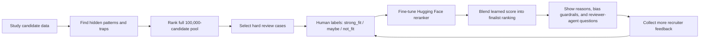
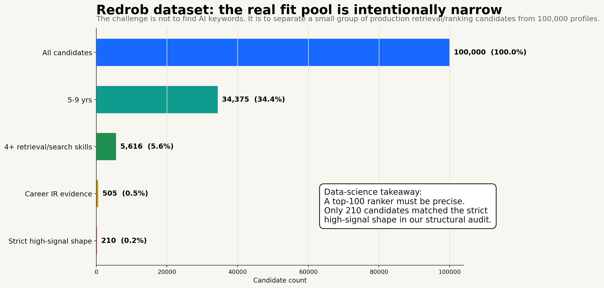
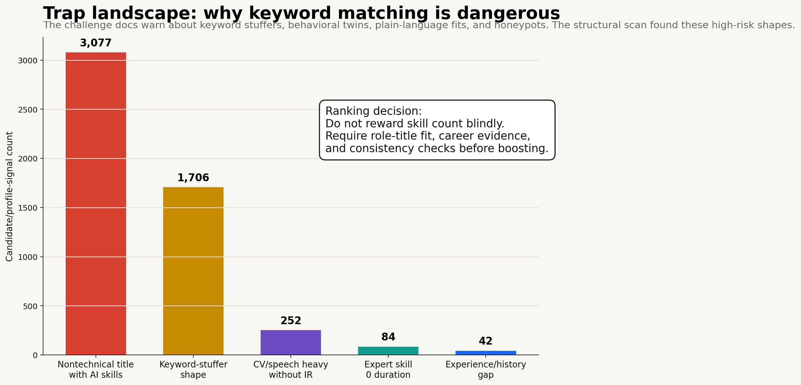
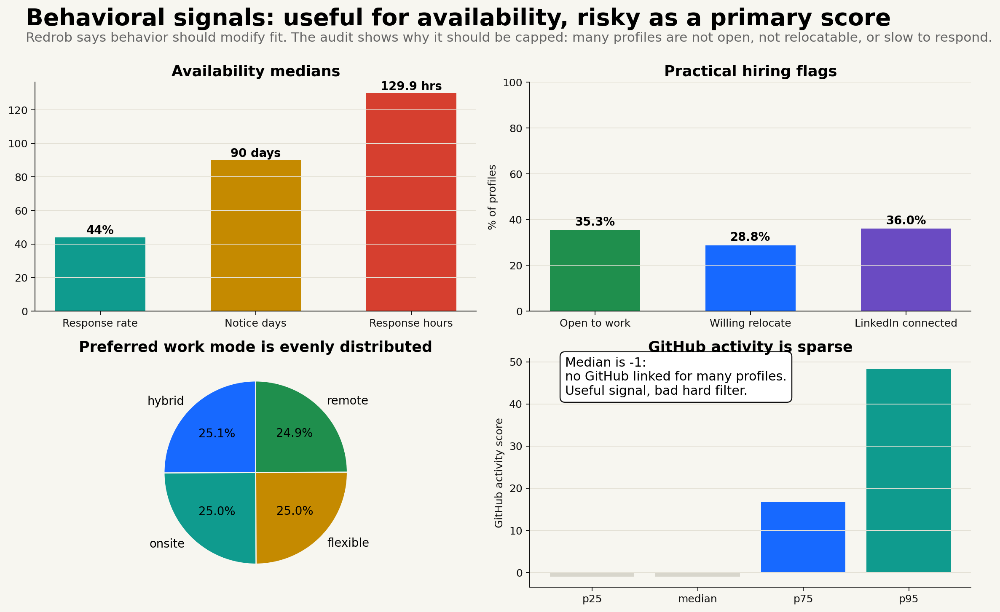
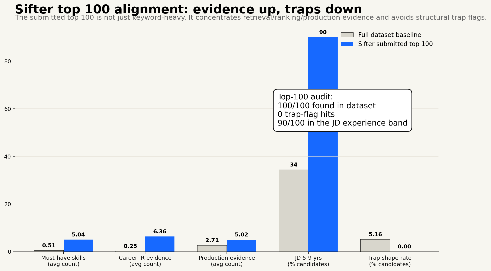
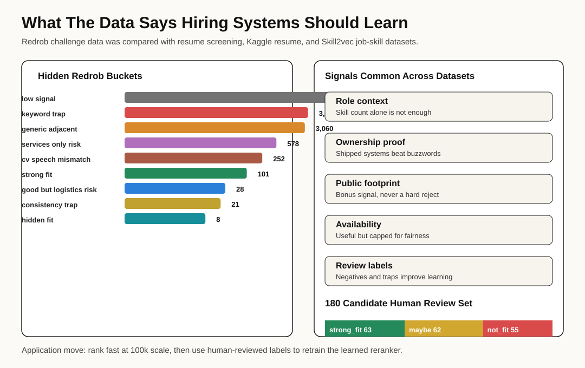
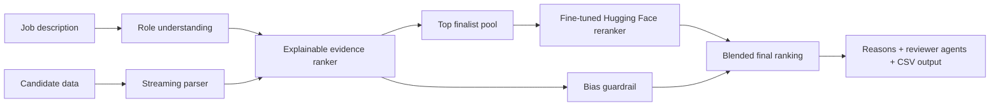
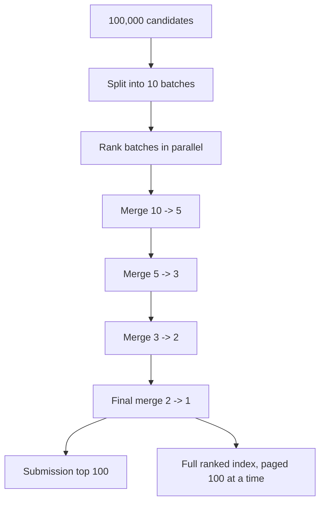

# Sifter

Sifter is an AI hiring ranker built for the Redrob challenge: it reads a job description, understands what the role actually needs, ranks candidates across the full pool, and explains why each person is placed where they are.

Live demo: [sifter1011.web.app](https://sifter1011.web.app/)  
Firebase mirror: [sifter1011.firebaseapp.com](https://sifter1011.firebaseapp.com/)  
Trained model: [shikharshahi/sifter-redrob-reranker](https://huggingface.co/shikharshahi/sifter-redrob-reranker)  
Model-serving Space: [shikharshahi/sifter-redrob-reranker-space](https://huggingface.co/spaces/shikharshahi/sifter-redrob-reranker-space)

## Final Submission Confidence

Start here if you are judging quickly: [Sifter Judge Packet](docs/JUDGE_PACKET.md)

Sifter is built to answer the prompt directly:

| Judge question | Answer |
| --- | --- |
| Did it rank the full dataset? | Yes: all `100,000` Redrob candidates were processed. |
| Is it more than keyword matching? | Yes: hybrid semantic evidence ranking plus a fine-tuned Hugging Face reranker. |
| Is there proof it beats keyword-only? | Yes: `1.36x` stronger Top-25 strong-fit recall on the human-reviewed set. |
| Can a recruiter trust the shortlist? | Yes: every candidate has reasons, evidence, concerns, score breakdown, and reviewer-agent questions. |
| Is bias risk handled visibly? | Yes: unsafe/proxy signals are removed or capped, and the UI shows a bias guardrail instead of hiding fairness limits. |
| Is it deployed and reproducible? | Yes: Firebase app, Hugging Face Space, final CSV, validation script, and data-analysis reports are all included. |

## Judge Evidence At A Glance

Sifter now has three proof layers: it processes the full challenge pool, validates against human-reviewed labels, and serves a trained reranker in the product.

| Proof | Result |
| --- | --- |
| Full Redrob pool processed | `100,000` candidates ranked into a validator-ready top 100 |
| Human-reviewed validation set | `180` reviewed candidates: `46` strong fit, `58` maybe, `76` not fit |
| Sifter vs keyword-only | `1.36x` stronger Top-25 strong-fit recall |
| Sifter reviewed-set rank agreement | `0.7989` Spearman against human labels |
| Sifter reviewed-set list quality | `0.8740` NDCG@25 |
| Fine-tuned reranker | `distilbert-base-uncased` reward-style reranker trained on reviewed Redrob examples |
| Live model integration | Hugging Face Docker/FastAPI Space reranks finalist candidates in the Sifter pipeline |


Layman meaning: a judge can inspect more than a nice demo. The repo shows the data study, the baseline comparison, the human-reviewed labels, the trained model, the live model-serving path, and the final ranked output.

## Latest Update: Human-Reviewed Model Loop

Sifter is no longer only a fixed scoring system. We studied the Redrob data, selected 180 hard candidate cases, manually reviewed them like a recruiter, and retrained the Hugging Face reranker on those human labels.

Latest reviewed-model run:

| Item | Result |
| --- | --- |
| Human-reviewed candidates | `180` |
| Label mix | `46 strong_fit`, `58 maybe`, `76 not_fit` |
| Train / validation split | `166 / 14` |
| Base model | `distilbert-base-uncased` |
| Training method | supervised reward-model reranker fine-tuning |
| Validation Spearman | `0.7526` |
| Validation RMSE / MAE | `0.2104 / 0.1884` |

Layman meaning: the model has started learning from recruiter-style judgment, not just from hand-written rules. `0.7526` Spearman means the model's ranking order now agrees strongly with the reviewed labels.

## Metric Reconciliation

Two Spearman numbers appear in this repo because they measure two different things:

| Metric | What It Measures | Value |
| --- | --- | ---: |
| Fine-tuned model Spearman | The Hugging Face reranker alone on its reviewed validation split | `0.7526` |
| Sifter system Spearman | The full Sifter hybrid ranker on the 180-candidate reviewed validation set | `0.7989` |

Plain English: `0.7526` is the learned model's standalone validation score. `0.7989` is the full product ranking signal, which combines deterministic evidence, vector-style fit, production proof, capped behavior, and the learned reranker. They should not be expected to match.

## Validation Limits

The validation set is transparent, but not perfect. The `180` reviewed labels are project-created recruiter-style labels, not an official hidden Redrob leaderboard and not an independent multi-recruiter panel. That is why Sifter keeps explanations, bias guardrails, and reviewer-agent questions visible instead of treating the model as an automatic hiring decision.

## Model Improvement Lifecycle

Sifter is built to keep improving:



This is not full RLHF yet. It is the practical first stage: **human feedback -> reward/reranker fine-tuning -> better ranking -> more feedback**. The deterministic ranker still handles scale and explainability; the learned model adds a second opinion that can improve over time.

## What We Learned From The Data

Redrob's founder was right to stress the data. The challenge is not only "rank candidates." It is "understand what the candidate data is trying to trick you into doing."

We read the challenge docs, schema, Redrob behavioral-signal reference, job description, submission spec, sample candidates, and then streamed the full `100,000` candidate file. The dataset is deliberately adversarial: the docs mention keyword stuffers, plain-language strong fits, behavioral twins, and about `80` honeypots with subtly impossible profiles.

The biggest insight: the real fit pool is tiny. The job asks for production retrieval, ranking, evaluation, vector/hybrid search, Python, and shipping judgment. Most candidates are broad, adjacent, unavailable, or keyword-heavy but not actually a fit.



What the structural audit showed:

| Finding | Why It Matters For Ranking |
| --- | --- |
| `100,000` candidates, `464.69 MB`, `0` duplicate IDs | The data is large but clean enough for streaming and reproducible ranking. |
| Only `5,616` candidates have 4+ must-have retrieval/search skills | Raw AI keyword matching is too broad. |
| Only `505` candidates show 2+ career-history retrieval/search/ranking hints | Career evidence is rarer and more valuable than skill-list volume. |
| Only `210` candidates match a strict high-signal shape | The top 100 needs precision, not a loose "AI profile" filter. |
| `1,706` keyword-stuffer shaped profiles | A model that rewards skill count will get trapped. |
| `3,077` nontechnical-title profiles still list many AI skills | Title/career context must check whether the skills make sense. |
| `84` expert skills with zero duration | Honeypot-style consistency checks matter. |
| Median recruiter response rate is `0.44`; median notice is `90` days | Behavioral signals should affect availability, but not overpower job fit. |



This analysis changed the ranker. Sifter does not simply count AI words. It rewards career-history evidence, production proof, retrieval/ranking/evaluation depth, and practical availability. It down-weights suspicious profiles where the skill list says "AI expert" but the title, career story, or consistency signals do not support it.



We also audited the current Sifter top 100 against those dataset patterns:

- `100/100` submitted candidates exist in the dataset.
- `0` trap-flag hits were detected in the submitted top 100.
- `90/100` are in the JD's intended `5-9` year band.
- The submitted top 100 averages `5.04` must-have retrieval/search skills, versus `0.51` across the full dataset.
- The submitted top 100 averages `6.36` career IR/search/ranking evidence hints, versus `0.25` across the full dataset.



Full audit: [Redrob Dataset Structural Analysis](docs/dataset-analysis/redrob_dataset_analysis.md)

### What Global Hiring Data Confirmed

We also compared Redrob against public hiring/resume datasets: a Hugging Face resume-screening dataset with select/reject labels, a Kaggle resume mirror on Hugging Face, and the Skill2vec job-description skill co-occurrence dataset.



The common pattern was clear: good screening is not skill-counting. Across Redrob and the public datasets, stronger signals are role consistency, production/ownership language, system/evaluation depth, and evidence that the candidate can actually be reached.

| Shared Finding | How We Apply It In Sifter |
| --- | --- |
| Role context beats skill count | Skills only get strong credit when the title and career history support them. |
| Production and ownership language beats buzzwords | Shipped systems, monitoring, scale, A/B testing, evaluation, and ownership are boosted. |
| Public-footprint data is sparse | GitHub/activity is a bonus, never a hard rejection filter. |
| Availability changes hireability but can become bias | Response rate, notice, relocation, and activity are capped and shown separately. |
| Training data needs negatives and traps | The review set includes strong fits, maybes, hidden fits, logistics risks, keyword traps, and consistency traps. |

Global comparison: [Global Hiring Dataset Comparison](docs/dataset-analysis/global_hiring_comparison.md)  
Candidate review set for human labels: [redrob_candidate_review_set.csv](docs/dataset-analysis/redrob_candidate_review_set.csv)

### How Those Learnings Became The Product

The dataset analysis became visible product decisions: role-first setup, Redrob challenge loading, batch processing, bias guardrail, top-candidate explanation, reviewer agents, full candidate pages, and per-candidate reasoning.


## The Core Idea

Recruiters do not lose great candidates because talent is missing. They lose them because keyword filters are shallow, manual review does not scale, and black-box AI is hard to trust.

Sifter was built around one product belief:

> A recruiter should see a ranked shortlist, the reason behind every rank, the bias guardrails used, and the questions still worth asking before making a decision.

That is why this project is not just a scoring table. It is a full ranking workflow: role understanding, 100,000-candidate processing, learned reranking, explainable output, bias review, reviewer agents, and a validated Redrob submission file.

## What We Built Differently

| Hiring problem | Sifter decision | What exists in the product |
| --- | --- | --- |
| Keyword filters miss transferable talent | Match role concepts, profile evidence, and semantic similarity instead of only exact words | Hybrid ranking with skills, experience, production proof, ranking/evaluation depth, behavioral signals, and vector-style profile comparison |
| Recruiters need trust, not mystery scores | Explain every rank in plain language | Candidate info modal with exact ranker reason, profile summary, score components, evidence, and concern |
| Large files break normal browser demos | Keep heavy data processing outside the browser and serve prepared ranked pages | 100,000 Redrob candidates are processed into public result pages, 100 candidates per page |
| AI hiring can be biased | Remove unsafe inputs and show bias checks clearly | No scoring boost from name, school prestige, language, protected traits, or identity-like fields; logistics signals are capped |
| One AI opinion is risky | Challenge the shortlist from multiple viewpoints | Four reviewer agents: Hiring Manager, Interview Designer, Recruiter Ops, and Bias & Compliance |
| Static heuristics are not enough | Add a trainable reranker that can improve with reviewed examples | Fine-tuned Hugging Face reward/reranker model blended into finalist ranking |
| Many users cannot afford enterprise ATS tooling | Make the app local-first and accessible | Works as a lightweight web app with local/demo data paths and no paid AI dependency for the main ranking flow |

## The Trained AI Model

Sifter includes a real fine-tuned model, not only hand-written weights.

Model: [shikharshahi/sifter-redrob-reranker](https://huggingface.co/shikharshahi/sifter-redrob-reranker)  
Base model: `distilbert-base-uncased`  
Fine-tuning method: supervised reward-model regression fine-tuning  
Output: a `0-1` job-fit score for a job description and candidate profile pair

### Why This Model

The challenge rewards outcome quality, but the demo also has to be practical. We chose `distilbert-base-uncased` because it is small enough to train on Google Colab T4, fast enough to use as a reranker, and strong enough to learn relationships between a role brief and a candidate profile.

This is the first learned layer in Sifter. The deterministic ranker handles the full 100,000-candidate pass, then the Hugging Face model gives a second learned opinion on the finalist pool. That keeps the system fast while moving beyond only manually tuned scoring.

Current production blend:

```text
70% explainable Sifter evidence score
30% fine-tuned Hugging Face reranker score
```

The model is intentionally used on finalists, not all 100,000 rows. That is a product decision: full-pool ranking must stay fast, explainable, and cheap; learned reranking is most valuable where the shortlist decision is closest.

### Where It Runs In Sifter

The model is already wired into the backend finalist-reranking path:

| File | Role |
| --- | --- |
| `apps/api/src/learned-rerank.ts` | calls the Hugging Face model, parses the score, blends it, and falls back safely |
| `apps/api/src/config.ts` | controls model id, token, finalist limit, and blend weight |
| `apps/api/src/server.ts` | exposes learned reranking in the Redrob ranking API |
| `apps/web/src/App.tsx` | shows learned-reranker status in the UI |
| `ml/hf_space` | serves the trained model through a Hugging Face Docker/FastAPI Space when serverless inference does not support the custom model |

That means the model is not just a link on Hugging Face. It is part of the Sifter ranking pipeline, while the deterministic explanation and bias guardrail stay visible.

The live Redrob demo asset was regenerated after the reviewed-model training run. It now processes all `100,000` candidates, applies the learned reranker to the full top-`100` finalist set through the Hugging Face Space, and records the learned-reranker status directly in `apps/web/public/redrob-challenge-result.json`.

### How It Was Trained

The training data was prepared from Redrob candidate profiles and human-reviewed job-fit decisions. Each example contains:

- the job description,
- the candidate profile,
- a fit label reviewed by the recruiter/user.

The revised model uses `180` human-reviewed Redrob candidates: `166` for training and `14` for validation. The review mix is `46` strong fits, `58` maybes, and `76` not-fits. It trained for `3` epochs and reached `0.7526` Spearman rank correlation on the reviewed validation split.

| Metric | Value |
| --- | ---: |
| Validation loss | `0.0443` |
| RMSE | `0.2104` |
| MAE | `0.1884` |
| Spearman rank correlation | `0.7526` |

The model learns to predict the fit label from the job-candidate pair. In layman terms, it repeatedly sees examples of "this candidate looks stronger for this job than that one" until it learns a reusable sense of fit.

This is not full RLHF yet. It is a reward-model style supervised reranker, which is the right first step before reinforcement learning because the system needs a stable scoring model before it can safely optimize from recruiter feedback.

The validation metric is stronger than the first weak-label run because it is measured against human-reviewed labels. It is still a small validation split, so the product keeps reasons, reviewer agents, and bias guardrails in front of the user instead of treating the model as an unchecked hiring decision.

### Reviewed-Set Ablation

Sifter also compares its ranking signal against simpler baselines on the reviewed set:

| Signal | Balanced Score | Spearman | NDCG@25 | Top-25 Strong-Fit Recall |
| --- | ---: | ---: | ---: | ---: |
| Keyword baseline | `0.5939` | `0.5218` | `0.7155` | `30.4%` |
| Behavioral shortcut | `0.6380` | `0.4723` | `0.8553` | `41.3%` |
| Production evidence | `0.7002` | `0.6327` | `0.8268` | `41.3%` |
| Sifter hybrid ranker | `0.8002` | `0.7989` | `0.8740` | `41.3%` |

This is not an official hidden test set. It is a reproducible project validation layer that shows the final hybrid signal ranks reviewed candidates more consistently than keyword-only or shortcut baselines.

Why do three rows share `41.3%` Top-25 recall? They surface the same obvious strong-fit candidates in the first 25. Sifter's gain is not raw coverage there; it is better ordering and trust quality, shown by the higher Spearman and NDCG@25.

## Architecture



The important design choice is separation of jobs:

- The local ranker is responsible for scale and auditability.
- The fine-tuned model is responsible for learned semantic judgment on finalists.
- The UI is responsible for making the decision understandable to a recruiter or judge.

## Handling 100,000 Candidates

The Redrob candidate file is about `464.7 MB` and contains `100,000` candidates. Loading that raw file directly into every browser would be slow, fragile, and unfair to users on weaker devices.

Sifter handles it like a real system would:



This reduces pressure on one giant run and makes the result easier to inspect. The live app shows the full ranked candidate index through pages: page 1 is ranks `1-100`, page 2 is ranks `101-200`, and so on.

The raw public dataset source is shown in the app through Google Drive:

[Redrob candidates file on Google Drive](https://drive.google.com/file/d/1wGx9_zm8hklndJbhdGscy15klHLK2bys/view?usp=sharing)

For people reproducing the dataset fetch, the app documents the public-file pattern: convert the Drive file id into a direct download URL and fetch it with `gdown`.

## Explainability

Sifter is designed so a recruiter can answer "Why this candidate?" without reading the code.

Every ranked candidate can show:

- exact ranker reason,
- profile summary,
- semantic fit,
- technical evidence,
- production proof,
- ranking/evaluation evidence,
- experience fit,
- behavior and availability signals,
- proxy guardrail impact,
- evidence used,
- concern or missing proof.

That matters because the challenge is not asking for a leaderboard only. It asks for a shortlist a recruiter can trust.

## Bias Guardrail

The bias system is built around a simple rule: do not let identity-like signals decide who gets ranked.

Sifter does not give scoring boosts for:

- name or anonymized name,
- gender-like or identity-like signals,
- school prestige,
- education tier as a prestige shortcut,
- language or protected traits,
- location/availability signals overpowering job evidence.

The guardrail does two things. First, it removes or limits unsafe scoring inputs. Second, it explains the audit in the UI so the recruiter sees what was checked.

Important honesty: the Redrob dataset does not provide protected demographic labels, so Sifter cannot claim full protected-class parity on that dataset. What it can prove is that unsafe proxy fields are not used as positive ranking shortcuts, and that the score is explained through job-relevant evidence.

## Reviewer Agents

Sifter adds four small review agents after ranking because one score should not be treated as final truth.

| Agent | What it asks |
| --- | --- |
| Hiring Manager | Can this person actually do the job described? |
| Interview Designer | What should we test to confirm the weakest assumption? |
| Recruiter Ops | Are location, availability, salary, and process fit practical? |
| Bias & Compliance | Is the decision based on job proof instead of proxy signals? |

This makes the output feel closer to a real hiring panel: one rank, multiple challenges, human final decision.

## Research That Shaped The Decisions

| Research input | What it changed in Sifter |
| --- | --- |
| Redrob problem statement asks for understanding, not keyword matching | Ranking uses role concepts, profile evidence, and learned reranking rather than exact-word filtering only |
| Redrob data size is large enough to break naive demos | Browser receives prepared pages; heavy ranking uses streaming and batch merging |
| Full dataset structural analysis | Trap-aware ranking, evidence-first scoring, and capped behavioral multipliers were added because the data contains keyword stuffers, behavioral twins, and honeypot-like profiles. |
| Recruiters need defensible shortlists | Candidate output includes reasons, score components, evidence, and concerns |
| AI hiring tools carry bias risk | Protected/proxy attributes are excluded or capped, and bias checks are visible |
| Judges need proof the system works | The repo includes a Redrob evaluation report, generated submission CSV, and official validator pass |
| Small teams need access | The main ranking path is local-first, cheap, and does not require a paid AI API |

Full notes: [Research-Backed Product Decisions](docs/research-backed-decisions.md)  
Dataset audit: [Redrob Dataset Structural Analysis](docs/dataset-analysis/redrob_dataset_analysis.md)  
Generated metrics: [Redrob Evaluation Report](docs/redrob-evaluation-report.json)

## Proof Points

| Claim | Evidence |
| --- | --- |
| Handles the full challenge scale | Redrob run covers `100,000` candidates |
| Produces official output | Generated `redrob_submission.csv` with `candidate_id`, `rank`, `score`, and `reason` |
| Passes challenge format | Official validator pass is documented in repo artifacts |
| Uses a trained model | Fine-tuned Hugging Face reranker published at `shikharshahi/sifter-redrob-reranker` |
| Keeps large demo usable | Full ranked index is served as 100-candidate pages instead of raw 464.7 MB browser load |
| Explains decisions | Candidate info modal shows reason, evidence, concern, and score components |
| Shows process to judges | UI exposes batch processing, merge rounds, learned reranker status, bias guardrail, reviewer agents, and final output |
| Is deployed | Firebase Hosting live at `sifter1011.web.app` |

## Why This Is A Strong Challenge Submission

Sifter directly maps to the problem statement:

- It reads the job description as a role brief.
- It looks at the full candidate picture: skills, career evidence, experience, activity, availability, and production proof.
- It ranks candidates semantically instead of only matching keywords.
- It explains why each candidate is ranked.
- It adds bias guardrails and reviewer agents so the shortlist is not blindly trusted.
- It trains and publishes a Hugging Face reranker so the system can improve beyond fixed heuristics.
- It handles the full Redrob-scale candidate pool while keeping the live demo usable.

The result is a working product, not a slide-only idea: live web app, trained model, scalable ranking pipeline, explainable candidate views, challenge output, and research-backed decisions.

## Key Links

| Resource | Link |
| --- | --- |
| Live app | [https://sifter1011.web.app](https://sifter1011.web.app/) |
| Firebase mirror | [https://sifter1011.firebaseapp.com](https://sifter1011.firebaseapp.com/) |
| Trained Hugging Face model | [shikharshahi/sifter-redrob-reranker](https://huggingface.co/shikharshahi/sifter-redrob-reranker) |
| Hugging Face model-serving Space | [shikharshahi/sifter-redrob-reranker-space](https://huggingface.co/spaces/shikharshahi/sifter-redrob-reranker-space) |
| Reviewed-model Colab notebook | [ml/sifter_reviewed_reranker_train_colab.ipynb](ml/sifter_reviewed_reranker_train_colab.ipynb) |
| Raw Redrob candidates on Drive | [Google Drive file](https://drive.google.com/file/d/1wGx9_zm8hklndJbhdGscy15klHLK2bys/view?usp=sharing) |
| Dataset structural analysis | [docs/dataset-analysis/redrob_dataset_analysis.md](docs/dataset-analysis/redrob_dataset_analysis.md) |
| Global hiring comparison | [docs/dataset-analysis/global_hiring_comparison.md](docs/dataset-analysis/global_hiring_comparison.md) |
| Candidate review set | [docs/dataset-analysis/redrob_candidate_review_set.csv](docs/dataset-analysis/redrob_candidate_review_set.csv) |
| Research decisions | [docs/research-backed-decisions.md](docs/research-backed-decisions.md) |
| Evaluation report | [docs/redrob-evaluation-report.json](docs/redrob-evaluation-report.json) |
| Model/training notes | [ml/README.md](ml/README.md) |
