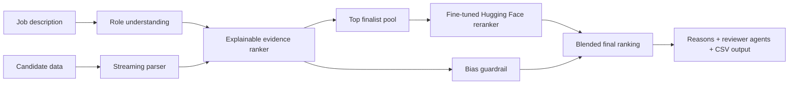
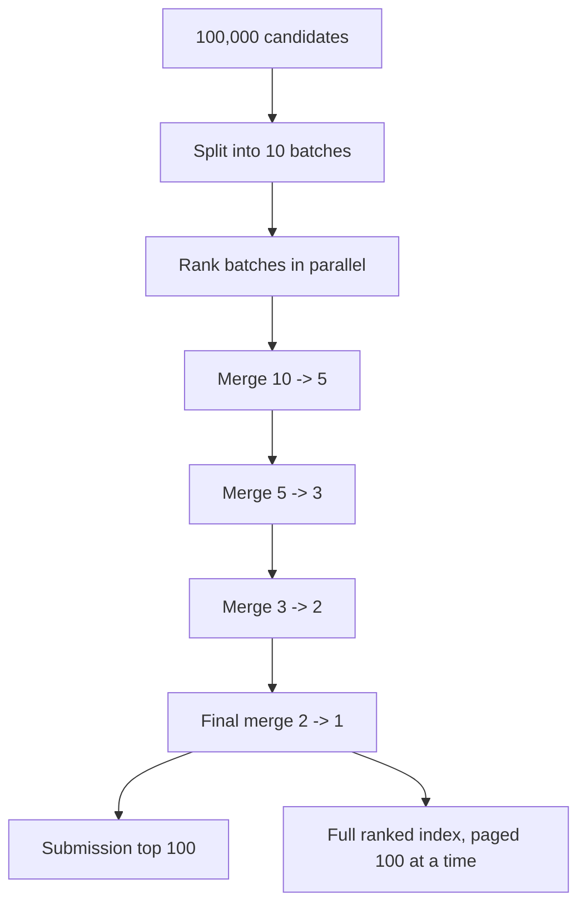

# Sifter

Sifter is an AI hiring ranker built for the Redrob challenge: it reads a job description, understands what the role actually needs, ranks candidates across the full pool, and explains why each person is placed where they are.

Live demo: [sifter1011.web.app](https://sifter1011.web.app/)  
Firebase mirror: [sifter1011.firebaseapp.com](https://sifter1011.firebaseapp.com/)  
Trained model: [shikharshahi/sifter-redrob-reranker](https://huggingface.co/shikharshahi/sifter-redrob-reranker)

## The Core Idea

Recruiters do not lose great candidates because talent is missing. They lose them because keyword filters are shallow, manual review does not scale, and black-box AI is hard to trust.

Sifter was built around one product belief:

> A recruiter should see a ranked shortlist, the reason behind every rank, the bias guardrails used, and the questions still worth asking before making a decision.

That is why this project is not just a scoring table. It is a full ranking workflow: role understanding, 100,000-candidate processing, learned reranking, explainable output, bias review, reviewer agents, and a validated Redrob submission file.

## What We Built Differently

| Hiring problem | Sifter decision | What exists in the product |
| --- | --- | --- |
| Keyword filters miss transferable talent | Match role concepts, profile evidence, and semantic similarity instead of only exact words | Hybrid ranking with skills, experience, production proof, ranking/evaluation depth, behavioral signals, and vector-style profile comparison |
| Recruiters need trust, not mystery scores | Explain every rank in plain language | Candidate info modal with exact ranker reason, profile summary, score components, evidence, and concern |
| Large files break normal browser demos | Keep heavy data processing outside the browser and serve prepared ranked pages | 100,000 Redrob candidates are processed into public result pages, 100 candidates per page |
| AI hiring can be biased | Remove unsafe inputs and show bias checks clearly | No scoring boost from name, school prestige, language, protected traits, or identity-like fields; logistics signals are capped |
| One AI opinion is risky | Challenge the shortlist from multiple viewpoints | Four reviewer agents: Hiring Manager, Interview Designer, Recruiter Ops, and Bias & Compliance |
| Static heuristics are not enough | Add a trainable reranker that can improve with feedback | Fine-tuned Hugging Face reward/reranker model blended into finalist ranking |
| Many users cannot afford enterprise ATS tooling | Make the app local-first and accessible | Works as a lightweight web app with local/demo data paths and no paid AI dependency for the main ranking flow |

## The Trained AI Model

Sifter includes a real fine-tuned model, not only hand-written weights.

Model: [shikharshahi/sifter-redrob-reranker](https://huggingface.co/shikharshahi/sifter-redrob-reranker)  
Base model: `distilbert-base-uncased`  
Fine-tuning method: supervised reward-model regression fine-tuning  
Output: a `0-1` job-fit score for a job description and candidate profile pair

### Why This Model

The challenge rewards outcome quality, but the demo also has to be practical. We chose `distilbert-base-uncased` because it is small enough to train on Google Colab T4, fast enough to use as a reranker, and strong enough to learn relationships between a role brief and a candidate profile.

This is the first learned layer in Sifter. The deterministic ranker handles the full 100,000-candidate pass, then the Hugging Face model gives a second learned opinion on the finalist pool. That keeps the system fast while moving beyond only manually tuned scoring.

Current production blend:

```text
70% explainable Sifter evidence score
30% fine-tuned Hugging Face reranker score
```

The model is intentionally used on finalists, not all 100,000 rows. That is a product decision: full-pool ranking must stay fast, explainable, and cheap; learned reranking is most valuable where the shortlist decision is closest.

### How It Was Trained

The training data was prepared from Redrob candidate profiles and job-fit signals. Each example contains:

- the job description,
- the candidate profile,
- a fit label derived from ranked evidence and optional recruiter-style feedback.

The model learns to predict the fit label from the job-candidate pair. In layman terms, it repeatedly sees examples of "this candidate looks stronger for this job than that one" until it learns a reusable sense of fit.

This is not full RLHF yet. It is a reward-model style supervised reranker, which is the right first step before reinforcement learning because the system needs a stable scoring model before it can safely optimize from recruiter feedback.

## Architecture



The important design choice is separation of jobs:

- The local ranker is responsible for scale and auditability.
- The fine-tuned model is responsible for learned semantic judgment on finalists.
- The UI is responsible for making the decision understandable to a recruiter or judge.

## Handling 100,000 Candidates

The Redrob candidate file is about `464.7 MB` and contains `100,000` candidates. Loading that raw file directly into every browser would be slow, fragile, and unfair to users on weaker devices.

Sifter handles it like a real system would:



This reduces pressure on one giant run and makes the result easier to inspect. The live app shows the full ranked candidate index through pages: page 1 is ranks `1-100`, page 2 is ranks `101-200`, and so on.

The raw public dataset source is shown in the app through Google Drive:

[Redrob candidates file on Google Drive](https://drive.google.com/file/d/1wGx9_zm8hklndJbhdGscy15klHLK2bys/view?usp=sharing)

For people reproducing the dataset fetch, the app documents the public-file pattern: convert the Drive file id into a direct download URL and fetch it with `gdown`.

## Explainability

Sifter is designed so a recruiter can answer "Why this candidate?" without reading the code.

Every ranked candidate can show:

- exact ranker reason,
- profile summary,
- semantic fit,
- technical evidence,
- production proof,
- ranking/evaluation evidence,
- experience fit,
- behavior and availability signals,
- proxy guardrail impact,
- evidence used,
- concern or missing proof.

That matters because the challenge is not asking for a leaderboard only. It asks for a shortlist a recruiter can trust.


## Bias Guardrail

The bias system is built around a simple rule: do not let identity-like signals decide who gets ranked.

Sifter does not give scoring boosts for:

- name or anonymized name,
- gender-like or identity-like signals,
- school prestige,
- education tier as a prestige shortcut,
- language or protected traits,
- location/availability signals overpowering job evidence.

The guardrail does two things. First, it removes or limits unsafe scoring inputs. Second, it explains the audit in the UI so the recruiter sees what was checked.

Important honesty: the Redrob dataset does not provide protected demographic labels, so Sifter cannot claim full protected-class parity on that dataset. What it can prove is that unsafe proxy fields are not used as positive ranking shortcuts, and that the score is explained through job-relevant evidence.

## Reviewer Agents

Sifter adds four small review agents after ranking because one score should not be treated as final truth.

| Agent | What it asks |
| --- | --- |
| Hiring Manager | Can this person actually do the job described? |
| Interview Designer | What should we test to confirm the weakest assumption? |
| Recruiter Ops | Are location, availability, salary, and process fit practical? |
| Bias & Compliance | Is the decision based on job proof instead of proxy signals? |

This makes the output feel closer to a real hiring panel: one rank, multiple challenges, human final decision.

## Research That Shaped The Decisions

| Research input | What it changed in Sifter |
| --- | --- |
| Redrob problem statement asks for understanding, not keyword matching | Ranking uses role concepts, profile evidence, and learned reranking rather than exact-word filtering only |
| Redrob data size is large enough to break naive demos | Browser receives prepared pages; heavy ranking uses streaming and batch merging |
| Recruiters need defensible shortlists | Candidate output includes reasons, score components, evidence, and concerns |
| AI hiring tools carry bias risk | Protected/proxy attributes are excluded or capped, and bias checks are visible |
| Judges need proof the system works | The repo includes a Redrob evaluation report, generated submission CSV, and official validator pass |
| Small teams need access | The main ranking path is local-first, cheap, and does not require a paid AI API |

Full notes: [Research-Backed Product Decisions](docs/research-backed-decisions.md)  
Generated metrics: [Redrob Evaluation Report](docs/redrob-evaluation-report.json)

## Proof Points

| Claim | Evidence |
| --- | --- |
| Handles the full challenge scale | Redrob run covers `100,000` candidates |
| Produces official output | Generated `redrob_submission.csv` with `candidate_id`, `rank`, `score`, and `reason` |
| Passes challenge format | Official validator pass is documented in repo artifacts |
| Uses a trained model | Fine-tuned Hugging Face reranker published at `shikharshahi/sifter-redrob-reranker` |
| Keeps large demo usable | Full ranked index is served as 100-candidate pages instead of raw 464.7 MB browser load |
| Explains decisions | Candidate info modal shows reason, evidence, concern, and score components |
| Shows process to judges | UI exposes batch processing, merge rounds, learned reranker status, bias guardrail, reviewer agents, and final output |
| Is deployed | Firebase Hosting live at `sifter1011.web.app` |

## Visuals

### Main Product


### Workflow


### Redrob Output


### Candidate Reason


## Why This Is A Strong Challenge Submission

Sifter directly maps to the problem statement:

- It reads the job description as a role brief.
- It looks at the full candidate picture: skills, career evidence, experience, activity, availability, and production proof.
- It ranks candidates semantically instead of only matching keywords.
- It explains why each candidate is ranked.
- It adds bias guardrails and reviewer agents so the shortlist is not blindly trusted.
- It trains and publishes a Hugging Face reranker so the system can improve beyond fixed heuristics.
- It handles the full Redrob-scale candidate pool while keeping the live demo usable.

The result is a working product, not a slide-only idea: live web app, trained model, scalable ranking pipeline, explainable candidate views, challenge output, and research-backed decisions.

## Key Links

| Resource | Link |
| --- | --- |
| Live app | [https://sifter1011.web.app](https://sifter1011.web.app/) |
| Firebase mirror | [https://sifter1011.firebaseapp.com](https://sifter1011.firebaseapp.com/) |
| Trained Hugging Face model | [shikharshahi/sifter-redrob-reranker](https://huggingface.co/shikharshahi/sifter-redrob-reranker) |
| Raw Redrob candidates on Drive | [Google Drive file](https://drive.google.com/file/d/1wGx9_zm8hklndJbhdGscy15klHLK2bys/view?usp=sharing) |
| Research decisions | [docs/research-backed-decisions.md](docs/research-backed-decisions.md) |
| Evaluation report | [docs/redrob-evaluation-report.json](docs/redrob-evaluation-report.json) |
| Model/training notes | [ml/README.md](ml/README.md) |
