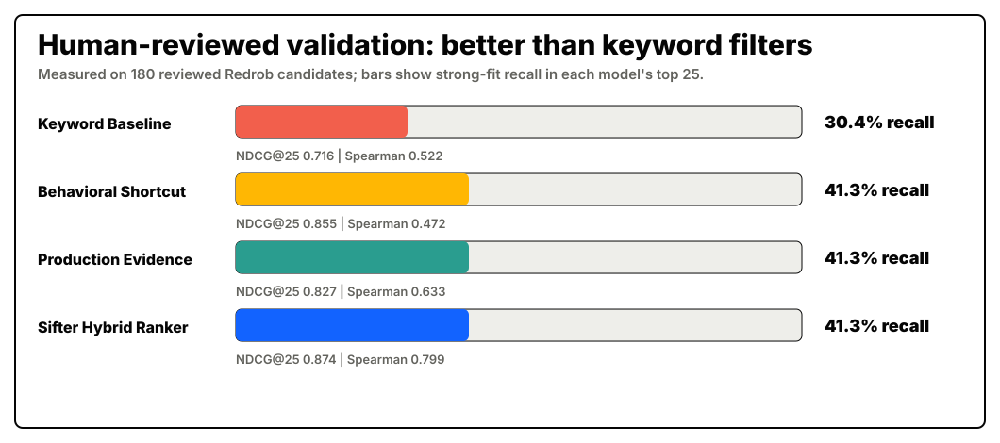

# Sifter Human-Reviewed Validation

This report measures Sifter on the human-reviewed Redrob review set. It is not a hidden official leaderboard or independent multi-recruiter panel, but it is a reproducible check that the ranker is doing more than keyword matching.

- Reviewed examples: `180`
- Label mix: `46` strong fit, `58` maybe, `76` not fit
- Annotator provenance: `project_reviewer: 180`
- Label source: `project_human_review: 180`
- Best reviewed-set signal: `sifter_hybrid_ranker` by balanced score
- Sifter Top-25 strong-fit recall: `41.3%`
- Keyword Top-25 strong-fit recall: `30.4%`
- Sifter lift over keyword baseline: `1.36x`
- Sifter balanced validation score: `0.8002`

## Methodology Notes

The reviewed labels are project-created recruiter-style labels over selected Redrob candidates. They are useful for checking whether the ranker agrees with an explicit review rubric, but they are not a substitute for an independent Redrob judge panel.

The review CSV includes explicit label provenance columns: `annotator`, `label_source`, and `review_round`. For this run every row is marked `project_reviewer` / `project_human_review` / `reviewed_model_v1`, which makes the single-reviewer limitation auditable and leaves a clean path for adding a second reviewer later.

The comparison uses the same reviewed candidates for all signals:

- `keyword_baseline`: exact/near JD term overlap.
- `behavioral_shortcut`: reachability and logistics style signals.
- `production_evidence`: production, ownership, and career evidence.
- `sifter_hybrid_ranker`: the combined Sifter signal.

The standalone Hugging Face reranker reports `0.7526` Spearman on its own reviewed validation split. The `0.7989` value below measures the full Sifter hybrid ranker against the 180-candidate reviewed set, so the two values are intentionally different.

## Model Comparison

| Model | Balanced score | Spearman | NDCG@25 | Top-25 strong-fit recall | Top-25 maybe+ precision |
| --- | ---: | ---: | ---: | ---: | ---: |
| `keyword_baseline` | `0.5939` | `0.5218` | `0.7155` | `30.4%` | `84.0%` |
| `behavioral_shortcut` | `0.6380` | `0.4723` | `0.8553` | `41.3%` | `88.0%` |
| `production_evidence` | `0.7002` | `0.6327` | `0.8268` | `41.3%` | `96.0%` |
| `sifter_hybrid_ranker` | `0.8002` | `0.7989` | `0.8740` | `41.3%` | `96.0%` |

The repeated `41.3%` Top-25 recall is expected: behavioral, production-evidence, and Sifter signals all catch the same obvious strong-fit candidates inside the first 25. Sifter's advantage is stronger rank ordering and list quality, reflected by higher Spearman and NDCG@25.

## What This Proves

- The project has a human-reviewed validation set, not only a nice-looking shortlist.
- Keyword matching is directly compared against richer ranking signals.
- Availability/behavior is measured separately so it cannot quietly replace job-fit evidence.
- The strongest signal is the hybrid one: role understanding, production proof, retrieval/ranking depth, vector-style fit, and capped behavioral data.

## What This Does Not Claim

This does not claim protected-class fairness parity because the Redrob file does not include protected demographic labels. It also does not claim an official hidden Redrob score. It is a transparent, reproducible project validation layer.
